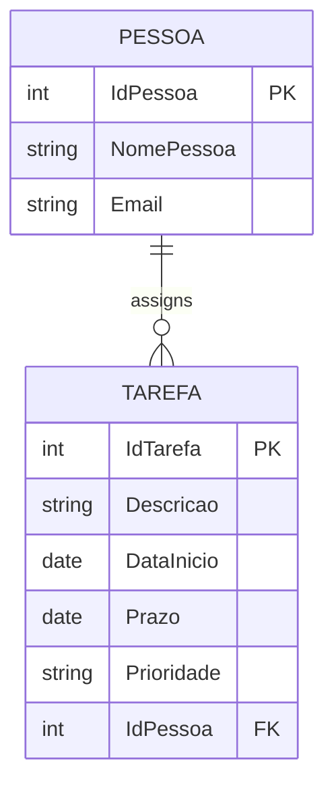

# TarefaCRUD

[](LICENSE.txt)
[](https://dotnet.microsoft.com/download/dotnet/6.0)
[](https://docs.microsoft.com/en-us/aspnet/core/mvc/overview)

Sistema completo de gerenciamento de **Pessoas** e **Tarefas** desenvolvido em **ASP.NET Core 6.0 (MVC)**. Projetado para a **TechCorp**, o sistema permite o cadastro, edição e exclusão de colaboradores e a gestão de suas tarefas com validações de data, prioridades e relacionamentos relacionais, utilizando interface responsiva e banco de dados SQL Server.

## 📑 Índice
- [Visão Geral & Funcionalidades](#-visão-geral--funcionalidades)
- [Tech Stack](#-tech-stack)
- [Pré-requisitos](#-pré-requisitos)
- [Primeiros Passos (Local)](#-primeiros-passos-local)
- [Arquitetura & Fluxo de Dados](#-arquitetura--fluxo-de-dados)
- [Schema do Banco de Dados](#-schema-do-banco-de-dados)
- [Variáveis de Ambiente & Configuração](#-variáveis-de-ambiente--configuração)
- [Scripts & Comandos Úteis](#-scripts--comandos-úteis)
- [Testes](#-testes)
- [Docker & Deploy](#-docker--deploy)
- [Solução de Problemas](#-solução-de-problemas)
- [Contribuição](#-contribuição)
- [Licença](#-licença)

---

## 📖 Visão Geral & Funcionalidades

O **TarefaCRUD** é uma aplicação web full-stack focada na gestão administrativa de equipes e suas atribuições. Utiliza o padrão MVC para separação de responsabilidades e Entity Framework Core para persistência de dados.

### Principais Funcionalidades
- ✅ **CRUD de Pessoas**: Cadastro com validação de e-mail único e telefone.
- ✅ **CRUD de Tarefas**: Gestão completa com título, datas e responsável.
- 🔗 **Relacionamento 1:N**: Vinculação automática de tarefas a uma pessoa.
- 🚫 **Integridade de Dados**: Impede a exclusão de uma pessoa caso ela possua tarefas ativas (Foreign Key constraint lógica).
- 📅 **Validação de Datas**: Garante que o *Prazo* seja posterior à *Data de Início*.
- 🏷️ **Prioridades**: Enumeração (Alta, Média, Baixa) com validação obrigatória.
- 📊 **Interface Responsiva**: Layout adaptável com Bootstrap 5, DataTables para listagem e ícones Boxicons.
- 🐳 **Suporte a Docker**: Dockerfile configurado para conteinerização rápida.

---

## 🛠 Tech Stack

| Camada | Tecnologia | Versão/Detalhe |
|--------|------------|----------------|
| **Linguagem** | C# 10+ | Nullable Reference Types ativado |
| **Framework** | ASP.NET Core 6.0 | Modelo MVC (Model-View-Controller) |
| **ORM** | Entity Framework Core 6.0 | Code-First com Migrations |
| **Banco de Dados** | Microsoft SQL Server | 2017+ |
| **Frontend** | Razor Views | HTML5, CSS3 |
| **UI Library** | Bootstrap 5 | Layout responsivo e componentes |
| **Scripts** | jQuery 3.x, DataTables 2.2 | Manipulação de DOM e tabelas |
| **Ícones** | Boxicons | Interface visual |
| **IDE** | Visual Studio 2022 / VS Code | Extensão C# Dev Kit |

---

## 📦 Pré-requisitos

Certifique-se de ter os seguintes itens instalados:
- `.NET 6.0 SDK` ([Download](https://dotnet.microsoft.com/download/dotnet/6.0))
- `SQL Server` (2017+) ou Docker com imagem `mcr.microsoft.com/mssql/server`
- `EF Core CLI Tools` (`dotnet tool install --global dotnet-ef`)
- `Git`
- IDE: Visual Studio 2022+ ou VS Code

---

## 🚀 Primeiros Passos (Local)

### 1. Clonar o Repositório
```bash
git clone <URL_DO_REPOSITORIO>.git
cd tyxiel-tarefacrud
```

### 2. Restaurar Dependências
```bash
dotnet restore
```
*Baixa os pacotes NuGet definidos em `TarefaCRUD.csproj`.*

### 3. Configurar String de Conexão
O arquivo `TarefaCRUD/appsettings.json` contém uma string de conexão de laboratório (SENAI). Para rodar localmente, edite-a ou use **User Secrets** (recomendado).

**Opção A: User Secrets**
```bash
cd TarefaCRUD
dotnet user-secrets init
dotnet user-secrets set "ConnectionStrings:Default" "Server=localhost;Database=TarefaDB;User Id=sa;Password=SuaSenha123!;TrustServerCertificate=True;"
```

**Opção B: Editar appsettings.json**
Altere diretamente o arquivo `TarefaCRUD/appsettings.json`:
```json
{
  "ConnectionStrings": {
    "Default": "Server=localhost;Database=TarefaDB;User Id=sa;Password=SuaSenha123!;TrustServerCertificate=True;"
  }
}
```

### 4. Aplicar Migrations
O EF Core criará o banco de dados e as tabelas baseadas no modelo:
```bash
dotnet ef database update --project TarefaCRUD
```
> **Nota:** As migrations já estão versionadas no repositório, então não é necessário criá-las do zero.

### 5. Executar Aplicação
```bash
dotnet run --project TarefaCRUD
```
Acesse em:
- HTTPS: `https://localhost:7092`
- HTTP: `http://localhost:5247`

> 💡 **Dica:** Use `dotnet watch run` para recarregar automaticamente ao salvar arquivos `.cs` ou `.cshtml`.

---

## 🏗 Arquitetura & Fluxo de Dados

### Estrutura de Diretórios
```
TarefaCRUD/
├── Controllers/      # Lógica de negócio e roteamento (Pessoa, Tarefa)
├── Models/           # Entidades (POCOs), Enums e DbContext
├── Views/            # Razor Pages (.cshtml)
├── Migrations/       # Histórico de evolução do Schema
├── wwwroot/          # Assets estáticos (CSS, JS, Libs)
├── Properties/       # Configurações de Launch
├── appsettings.json  # Configuração base
└── Dockerfile        # Configuração para containerização
```

### Fluxo da Requisição (Ex: Criar Tarefa)
1. **Cliente** acessa `/Tarefa/Create`.
2. **Controller** (`TarefaController`) popula `ViewData` com Dropdowns (Pessoas, Prioridade).
3. **View** renderiza formulário com validação client-side (jQuery Validate).
4. **Submit** envia POST para `/Tarefa/Create`.
5. **Controller** recebe `Tarefa` objeto, verifica `ModelState` (validações de Data/Prioridade).
6. **EF Core** insere no banco (`_context.Tarefas.Add` -> `SaveChanges`).
7. **Redirecionamento** para `Index` com a lista atualizada.

### Regras de Negócio Críticas
- **Deleção de Pessoa**: O `PessoaController` verifica `await _context.Tarefas.AnyAsync(t => t.IdPessoa == id)` antes de deletar. Se houver tarefas, retorna erro via `TempData`.
- **Validação de Prazo**: Implementado via `IValidatableObject` no modelo `Tarefa.cs`. Impede `Prazo < DataInicio`.

---

## 🗄 Schema do Banco de Dados



- **Pessoa**: `idPessoa` (PK), `nomePessoa`, `email` (Único, Varchar 50).
- **Tarefa**: `idTarefa` (PK), `descricao`, `dataInicio`, `prazo`, `prioridade` (String "Alta", "Media", "Baixa"), `idPessoa` (FK).

---

## 🔐 Variáveis de Ambiente & Configuração

| Variável | Descrição | Exemplo | Obrigatório |
|----------|-----------|---------|:-----------:|
| `ConnectionStrings:Default` | String de conexão SQL Server | `Server=...;Database=...` | ✅ Sim |
| `ASPNETCORE_ENVIRONMENT` | Ambiente de execução | `Development`, `Production` | ❌ Não |
| `Logging:LogLevel:Default` | Nível de log | `Information`, `Warning` | ❌ Não |

---

## 📜 Scripts & Comandos Úteis

| Comando | Descrição |
|---------|-----------|
| `dotnet run` | Compila e executa a aplicação |
| `dotnet watch run` | Modo desenvolvimento com Hot Reload |
| `dotnet build` | Compila o projeto sem executar |
| `dotnet ef database update` | Aplica migrations pendentes no banco |
| `dotnet ef migrations add Nome` | Cria nova migration após alterar Models |
| `dotnet publish -c Release` | Gera binários para deploy |

---

## 🧪 Testes

O projeto não inclui suíte de testes automatizados na estrutura atual. Para adicionar testes unitários:

1. Crie um projeto xUnit:
   ```bash
   dotnet new xunit -n TarefaCRUD.Tests
   dotnet add TarefaCRUD.Tests reference TarefaCRUD/TarefaCRUD.csproj
   ```
2. Exemplo de teste de validação de Tarefa:
   ```csharp
   [Fact]
   public void Tarefa_PrazoAnteriorInicio_DeveRetornarErro()
   {
       var tarefa = new Tarefa {
           DataInicio = new DateTime(2025, 1, 10),
           Prazo = new DateTime(2025, 1, 5)
       };
       var results = new List<ValidationResult>();
       var context = new ValidationContext(tarefa);
       var isValid = Validator.TryValidateObject(tarefa, context, results, true);
       
       Assert.False(isValid);
   }
   ```

---

## 🌐 Docker & Deploy

O projeto inclui um `Dockerfile` otimizado com multi-stage build.

### 1. Build da Imagem
```bash
docker build -t tarefacrud-app .
```

### 2. Execução com Banco de Dados
É necessário conectar a um container SQL Server ou instância externa.
```bash
docker run -d \
  --name tarefacrud-web \
  -p 8080:80 \
  -e "ConnectionStrings__Default=Server=host.docker.internal;Database=TarefaDB;User Id=sa;Password=Senha123!;TrustServerCertificate=True;" \
  tarefacrud-app
```
> ⚠️ **Atenção:** Em ambiente Linux, substitua `host.docker.internal` pelo IP do host.

---

## 🛠 Solução de Problemas

| Erro | Causa Provável | Solução |
|------|----------------|---------|
| `SqlException: Login failed` | Credenciais inválidas ou banco offline | Verifique `appsettings.json` e se o serviço SQL está rodando. |
| `dotnet: command not found` | SDK não instalado | Instale o [.NET 6 SDK](https://dotnet.microsoft.com/download). |
| `Microsoft.EntityFrameworkCore is not available` | Pacotes não restaurados | Rode `dotnet restore`. |
| `The view 'Index' was not found` | Erro de nomenclatura | Verifique se `Views/Tarefa/Index.cshtml` existe (case-sensitive no Linux). |

---

## 🤝 Contribuição

1. Faça um fork do projeto
2. Crie uma branch para sua feature (`git checkout -b feature/ValidacaoAvancada`)
3. Commit suas mudanças (`git commit -m 'feat: adiciona validação de CPF'`)
4. Push para a branch (`git push origin feature/ValidacaoAvancada`)
5. Abra um Pull Request

> 💡 Siga as convenções de nomenclatura `snake_case` para tabelas e `PascalCase` para Classes C#, conforme o padrão já adotado no projeto.

---

## 📄 Licença

Este projeto está licenciado sob a **GNU Affero General Public License v3.0** (AGPL-3.0).
Qualquer uso em rede ou servidor público requer a disponibilização do código-fonte completo da versão modificada, conforme seção 13 da licença.

Para mais detalhes: [LICENSE.txt](LICENSE.txt)
